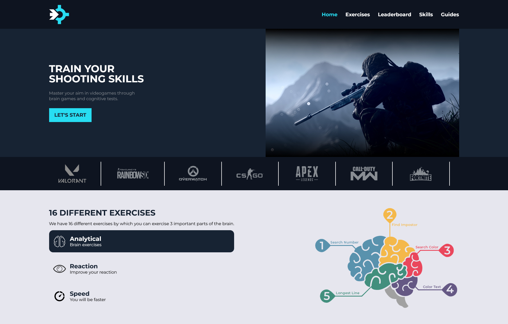
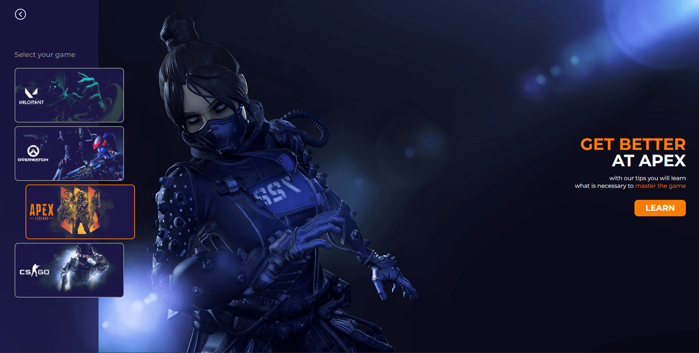

<p align="center">
   
</p>

# Aim Max

[](https://github.com/jgtavarez)
[](#)

<p>
  <a href="#closed_book-about-the-project">About the project</a>&nbsp;&nbsp;&nbsp;|&nbsp;&nbsp;&nbsp;
  <a href="#construction_worker-installation">Installation</a>&nbsp;&nbsp;&nbsp;|&nbsp;&nbsp;&nbsp;
  <a href="#rocket-getting-started">Getting Started</a>&nbsp;&nbsp;&nbsp;|&nbsp;&nbsp;&nbsp;
  <a href="#hammer-built-with">Built with</a>&nbsp;&nbsp;&nbsp;
</p>

<br>
<p align="center">
  </p>
<p align="center">
  
</p>
<br>

# :closed_book: About the project

Web Application responsible for helping you master your aim in video games through mental games and cognitive tests. It has a total of 16 different exercises which will help you develop different parts of the brain.

# :construction_worker: Installation

**You need to install [Node.js](https://nodejs.org/en/download/) first, then in order to clone the project via HTTPS, run this command:**

```git clone https://github.com/jgtavarez/aim-max.git```

Or via SSH:

```git clone git@github.com:jgtavarez/aim-max.git```

**Install dependencies**

```npm install```

# :rocket: Getting Started

### `npm start`

Runs the app in the development mode.\
Open [http://localhost:3000](http://localhost:3000) to view it in the browser.

The page will reload if you make edits.\
You will also see any lint errors in the console.

### `npm run server`

npm run server: start to run the server by default in port 7000,
if you edit some code it will update like npm start but this work in back-end, 
server all time read dist/index.html, so if you make changes in the frontend
make sure you updated with npm run build.

### `npm test`

Launches the test runner in the interactive watch mode.\
See the section about [running tests](https://facebook.github.io/create-react-app/docs/running-tests) for more information.

### `npm run build`

Builds the app for production to the `build` folder.\
It correctly bundles React in production mode and optimizes the build for the best performance.

The build is minified and the filenames include the hashes.\
Your app is ready to be deployed!

See the section about [deployment](https://facebook.github.io/create-react-app/docs/deployment) for more information.

# :hammer: Built With

- [React](https://reactjs.org)
- [TypeScript](https://www.typescriptlang.org/)
- [Tailwind](https://tailwindcss.com/)